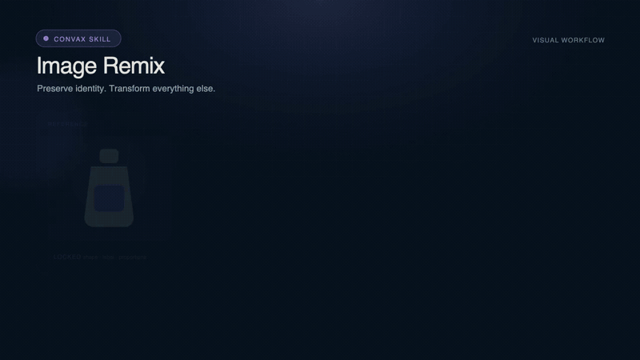

[English](README.md) | [简体中文](README.zh-CN.md)

# Convax 扩展与 Marketplace 仓库

这是 Convax Plugin、可移植 [Agent Skills](https://agentskills.io/) 与标准 MCP
Server 的官方源码仓库、开发工具和发布目录。这里发布的技能遵循开放的 `SKILL.md`
格式，可供 OpenAI Codex 等兼容客户端使用，并非只能在 Convax 中运行。

开发者或 AI 可以从模板开始，编写能够独立校验、确定性打包并由 Convax 安全下载的
Plugin、Skill 或 MCP Server。包源码通过 Git 进行审查，不可变工件由 GitHub
Releases 发布，Marketplace descriptor 由 GitHub Pages 承载：
`https://microvoid.github.io/convax-plugins/marketplace.json`。当前只发布 Registry
v2；本仓不再生成或发布旧 Registry 投影。



重点技能可以在不可变 Release ZIP 旁发布封面与动图。Convax 会通过独立 Showcase
索引校验媒体并在目录中播放；这些展示资源不会进入可移植技能包。

## 快速开始

环境要求：[Bun](https://bun.sh/) 1.3.14 或更高版本。

整个工作区只需统一安装一次。每个插件、技能和工具都在自己的 `package.json` 中声明
依赖，根锁文件保证 monorepo 可复现，无需在 CI 中逐个枚举包名。

```sh
bun install --frozen-lockfile --ignore-scripts
```

```sh
cp -R templates/plugin-basic packages/plugins/my-plugin
# 替换所有 __TOKEN__，然后实现 package/index.html。
bun run validate
bun test
bun run pack -- --kind plugin --id my-plugin
```

开发技能时，改用可移植技能模板：

```sh
cp -R templates/skill-basic packages/skills/my-skill
# 替换 convax-package.json、SKILL.md 和 agents/openai.yaml 中的全部 __TOKEN__。
bun run validate
bun test
bun run pack -- --kind skill --id my-skill
```

生成的插件 ZIP 在根目录包含 `manifest.json`，技能 ZIP 在根目录包含
`SKILL.md`。校验和打包期间不会安装依赖，也不会执行投稿者提供的构建脚本。

作者源码只有一种可发布格式：包元数据必须使用 `convax.package/2`，所有 Plugin
manifest 必须使用 `convax.plugin/8`。`convax.package/2` 不再提供兼容性逃生口，
且不承载 publication 状态。发布资格的唯一 owner 是
`registry/host-capability-policy.json`：它把每个 pending 的
`docs/host-capability-requests/*.md` 反向绑定到精确包版本。每个受影响 workspace
还必须在 `package.json#convax.hostCapabilityRequests` 中独立声明 request id，
因此改写业务实现不能静默消除治理义务。常规源码校验会接纳并明确报告 blocked
包；精确包打包会拒绝它们，Release selection 和 Marketplace composition 则省略
它们及其 owner/owned-Skill 闭包，同时继续处理无关的 ready 包。

不可变 Registry 历史中仍可能存在切换前的包与 Plugin Schema，客户端可以继续读取
这些历史条目；但模板、源码校验、打包、Marketplace 构建和 Release 规划都不会把旧
Schema 接纳为新的发布候选。

插件拥有的 Skill 能力说明由已安装的 `@convax/plugin-api` 和
`@convax/plugin-sdk` 提供确定性 renderer，并由 Marketplace Kit 在构建和发布时
注入。源码阶段只检查声明与稳定链接，不生成文件：

```sh
bun run skill-api:check
```

`contributes.skills[].uses.requiredHostApis` 与 `optionalHostApis` 只能选择
SDK Catalog 中 audience 包含 `agent-skill` 的 API。`uses.pluginTools` 填写该 Plugin
在 `contributes.agent.tools` 中声明的 lower_snake_case Agent tool id，不是底层
generation tool、provider 或 Host API 名称。

`references/convax-capabilities.md` 与
`references/plugin-capabilities.md` 是保留的产物路径，源码不得创建。Kit 注入的
确定性字节会同时进入可移植 Skill 和所属 Plugin 快照，记录 API 子集、`since`
版本、运行时可用性规则，以及跨 Plugin import/export schema。`SKILL.md` 只保留
稳定索引链接。宿主升级不会擅自重写已经安装的 Skill。

## 创建第三方 Marketplace

公开 scaffold 和 Kit 与 Official Marketplace 使用同一套 Plugin、Skill 和 MCP
Server 合约：

```sh
bunx create-convax-marketplace@0.1.0 my-market \
  --owner my-org \
  --repository my-market \
  --starter mcp-server
cd my-market
bun run check
bun run build-index
```

使用 `bun run marketplace -- new plugin --id my-plugin` 新增包。对于经过审查的
managed-stdio MCP companion，使用
`bun run marketplace -- add-target packages/mcp-servers/example-mcp --target darwin-arm64 --file /path/to/reviewed-companion`
接纳一个目标；裸可执行文件只会复制到私有作者输入区，源路径不会进入发布结果。

可执行的 `convax.plugin/8` 工具插件可以是无界面的。声明式贡献将可执行工具、
模型选择器、Agent 工具、画布选中动作和插件拥有的 Skill 分开。本地可执行
贡献通过 manifest 声明一个单独安装的裸 `mcp-stdio` 命令，但绝不内嵌可执行文件、
依赖、厂商凭据或 provider 配置。参见
[`docs/plugin-authoring.md`](docs/plugin-authoring.md#declarative-tool-plugin)。
对于经过审查的第一方工具，Registry 会在 ZIP 之外发布精确到平台和架构的 companion
工件。Convax 按字节数和 SHA-256 校验后写入宿主管理目录，因此用户无需通过 `PATH`
手工安装 sidecar，可执行文件也始终不会进入插件包。

插件也可以通过 `hooks` 声明一个自包含的 OpenCode Hook 模块。Convax 只会在用户明确
安装或更新时对其 JavaScript 字节做快照和指纹绑定，再由 OpenCode 加载宿主私有快照。
Hook 事件完全沿用 OpenCode，Convax 不会另造一套 Hook API。由于它是可执行 Agent
代码而不是 iframe 内容，默认安装和后台更新不会静默授权新的 Hook 字节。详见
[`docs/plugin-authoring.md`](docs/plugin-authoring.md#agent-hooks)。

`convax.plugin/8` Web 入口在构建时打包
`@convax/plugin-sdk/client` 的 `createPluginHostClient`，并使用其
`convax.plugin-host/8` ABI 和显式版本化的 `hostApi` 声明。手写请求 envelope、
pending Map 和 MessagePort 响应分发会被一致性检查拒绝。它支持
Project/Canvas 权限、通用 LLM 展示元数据和一个 HTTPS 远程 Agent MCP 端点。
Convax 将该端点和标准
OAuth 委托给 OpenCode/原生 MCP 宿主，远程服务继续拥有自己的账号和鉴权系统。声明中
不包含本地命令、适配层或秘密，只允许有界的非凭据字面量请求头。具体插件、Skill 和
受审 companion 源码继续归本仓库所有，不会移入 Convax 宿主。

v8 的 Canvas UI 只有一份规范的 `commands` 注册表。`toolbar` 和 `menus`
只是引用命令的放置列表；命令标题、宿主图标 token 和 `renderer-message` 目标不得在
放置记录中重复或覆盖。菜单只能放入所属节点的 `overflow`，两个入口被触发时都只会向
该节点当前存活的沙箱 renderer 投递声明的消息，不会因此获得 Host API 权限。旧式内联
toolbar/menu 定义不再接受。详见
[`docs/plugin-authoring.md`](docs/plugin-authoring.md#canvas-commands-and-placements)。

v8 图片选中操作可以声明一个 `editor: "immediate"` 步骤和宿主渲染的
`cutout-scan` 展示；其通用工具必须接收 `reference_image` 并返回一张图片。
宿主保留源节点并拥有相邻 pending/结果节点生命周期，不得按插件 ID 分支。

v8 也支持画布 sink 操作：Web 节点只能查看直接连入媒体的无路径元数据；manifest
声明的本地操作可以把 Agent 引用约束到这些精确入边，并把有界文本结果返回给 Agent，
而不创建额外画布节点。连线变化只刷新待处理输入，任何外部传输仍需用户明确触发。

`convax.plugin/8` 支持插件拥有的技能。插件通过 `contributes.skills` 声明技能，
打包器会把对应的标准技能 workspace 注入插件 ZIP。Convax 可以在技能列表中展示它，
但安装、更新和卸载生命周期都归插件所有。独立技能 ZIP 仍可供 Codex 及其他兼容
Agent Skills 的客户端使用。由于同一份源码会同时改变两个压缩包，发布插件拥有的技能时
必须同步提升并发布所属插件版本。若所属插件与技能的新 Release 尚未齐全，Pages 会继续
展示上一组已发布版本，等双方都发布后再一起更新。

每个插件拥有的 Skill 可以声明最小 `uses` 子集：`requiredHostApis`、
`optionalHostApis` 和 `pluginTools`。前两者会同时对 `@convax/plugin-api`
Catalog 和顶层
`hostApi` 声明校验；`pluginTools` 指向 `contributes.agent.tools` 中面向 Agent
的 id。SDK renderer 会把该 id 解析为底层 Plugin tool 说明，而运行时 `tools/list` 响应
仍是唯一权威。

v8 宿主能力还包括沙箱化桌面宠物功能。一个
Pet 功能插件通过 `contributes.pet`
提供静态悬浮窗、设置页面和 `convax.pet-library/1` 内置宠物库。页面通过受限的
`convax.pet-host/1` 协议使用宿主能力；Convax 仅保留原生窗口、无内容活动投影、
受控导航、已安装资产读取和有限持久化。可参考完整示例
[`packages/plugins/convax-pet`](packages/plugins/convax-pet)。

可以先阅读完整示例
[`packages/plugins/hello-convax`](packages/plugins/hello-convax)，然后参考：

- [`docs/plugin-authoring.md`](docs/plugin-authoring.md)：沙箱和宿主协议；
- [`docs/panorama-viewer.md`](docs/panorama-viewer.md)：全景图预览的唯一源码归属与旧内置迁移边界；
- [`docs/cutout-studio.md`](docs/cutout-studio.md)：本地模型、受审 companion 与相邻结果节点契约；
- [`docs/storyboard-studio.md`](docs/storyboard-studio.md)：分集故事文件、人物卡、Agent 自动打组流程与当前宿主能力边界；
- [`docs/storyai-3d-director-desk.md`](docs/storyai-3d-director-desk.md)：3D 导演台的唯一源码归属、上游固定与旧内置迁移边界；
- [`docs/skill-authoring.md`](docs/skill-authoring.md)：安全、可移植的技能规范；
- [`docs/packaging.md`](docs/packaging.md)：ZIP 和发布规则；
- [`docs/registry-spec.md`](docs/registry-spec.md)：客户端 Registry 协议；
- [`CONTRIBUTING.md`](CONTRIBUTING.md)：提交拉取请求前的贡献规范。

## 可移植技能边界

技能包发布时，只有 `package/` 中的内容会进入 ZIP。这个目录就是标准 Agent Skill
根目录：`SKILL.md` 是必需入口，`scripts/`、`references/`、`assets/` 和
`agents/openai.yaml` 等客户端元数据均为可选内容。兼容客户端可以忽略其他客户端的
扩展元数据，不影响技能工作流。

不要在单个技能包中加入 `README.md`、安装指南、更新日志或发布说明。面向智能体的入口
是 `SKILL.md`，仓库与市场说明应放在 `package/` 之外。同样，
`convax-package.json` 应与 `package/` 并列；它只描述 Convax 目录和发布信息，明确
不会进入可移植技能 ZIP。

技能可以提到某种宿主集成，但必须先以当前会话实际存在的能力为准。可选工具缺失、拒绝、
取消或失败时，应提供诚实的降级结果：能交付方案时就交付方案，否则停止并说明无法执行的
操作。不得虚构工具调用，也不得声称并未真正完成的产物、安装或变更已经成功。

## 在 Convax 中安装

在兼容版本的 Convax 中打开“设置 → 技能与插件”。能力目录从上面的公开 Registry
加载。点击安装插件或安装技能后，渲染进程只会把包标识传给主进程，由主进程下载并
校验对应的不可变 Release ZIP。
若 v8 插件为本地 runtime 声明了 Registry companion，同一次安装会只选择当前
平台和架构的精确工件，
并在静态 ZIP 之外独立校验其不可变 URL、字节数和 SHA-256。
插件拥有的技能也在同一插件事务中接纳和移除，不能在 Convax 中
独立安装或卸载。

`microvoid/convax-plugins` 仓库、Registry 和 Release 资源都是公开的，不需要
GitHub 账号或令牌。主应用仓库 `microvoid/convax` 可以继续保持私有，不会影响包安装。

## 仓库结构

```text
packages/plugins/<id>/
  package.json             # workspace 依赖与开发脚本
  convax-package.json      # Convax 发布元数据，不进入 ZIP
  package/                 # ZIP 根目录，必须包含 manifest.json
packages/skills/<id>/
  package.json             # workspace 依赖与开发脚本
  convax-package.json      # Convax 发布元数据，不进入 ZIP
  package/                 # 可移植技能根目录，必须包含 SKILL.md
  showcase/                # 可选目录封面和动图，不进入 ZIP
packages/mcp-servers/<id>/
  server.json              # 标准 MCP identity/version 和固定 HTTPS profile
  convax-mcp.json          # 仅 managed-stdio 使用
packages/tools/<id>/       # 经审查的工具 workspace，单独分发
templates/                 # 可直接复制的开发模板
tooling/                   # 校验与确定性 ZIP 工具
dist/                      # 生成目录，不提交到 Git
```

## 常用命令

```sh
bun run validate            # 校验全部源码包
bun run pack -- --kind plugin --id hello-convax # 打包一个当前格式的包
bun run workspaces:build:packages # 构建自包含的技能和插件包目录
bun run workspaces:typecheck # 检查声明了脚本的 workspace
bun run workspaces:test     # 测试声明了脚本的 workspace
bun test                    # 运行校验器、ZIP、Registry 和协议测试
bun run skill-api:check     # 校验 owned Skill 的 SDK 输入、保留路径和稳定链接
bun run build:companions    # 编译明确审查过的平台目标
bun run marketplace:check  # 通过打包后的 Kit 执行 fail-closed 作者校验
bun run marketplace:build  # fail-closed 生成 Registry v2、Release、Builtin 与 lock input
bun run check               # 执行完整 fail-closed 本地 CI
```

Marketplace 发布消费公开 authoring contract：
`@convax/plugin-api@1.0.0`、`@convax/plugin-sdk@0.1.0` 与
`@convax/marketplace-kit@0.2.0`。本地源码 link 只用于验证，不是有效的发布依赖；
三个精确版本都必须先在配置的 registry 可用，干净 frozen install 与发布才可成功。
参见 [SDK authoring rollout blocker](docs/sdk-authoring-contract-rollout.md)。

作者只修改 Plugin、
Skill 或 MCP Server 的 identity version，并通过受保护的 `main` 合入；不再手工创建
发布标签。默认分支工作流会拒绝“字节变化但 version 未变化”，在低权限 job 中生成
确定性工件，再由最小权限发布 job 只发布已经验证的精确字节。Registry v2、
Showcase v2 和不可变 Builtin bundle 都由工具生成，不手写；不再保留 Registry v1
authoring 或发布路径。

`bun run check` 会接纳 policy 一致的 blocked 源码并明确报告；旧包或旧 Plugin
Schema、request 声明/policy/文档绑定缺失、插件拥有的 Skill 生成说明过期、未知
Host API 或 Agent tool 仍会 fail closed。精确打包会拒绝 blocked 目标；
Marketplace 和 Release 输出只包含 ready 闭包，并为省略版本生成机器可读诊断。

## 安装问题排查

- `Redirect was cancelled` 表示旧版 Convax 没有正确适配 Electron 对 GitHub
  Release 手动重定向的处理方式。请升级到包含 Electron Release 重定向适配器的版本。
- `Unable to connect` 通常来自代理、DNS、防火墙或离线状态。请在同一台机器上同时检查
  Registry 地址和条目中的 `artifact.url` 是否可访问。
- HTTP `404` 或 `403` 应直接对照 Registry 中的公开地址排查。任何安装请求都不应依赖
  私有的 Convax 主应用仓库。
- 大小、SHA-256、Schema、兼容性或 ZIP 校验失败属于预期的安全拒绝。不要绕过校验，
  应检查已经发布的 Registry 条目和 Release 资源。

## 安全边界

第三方插件 ZIP 在校验和打包阶段始终按惰性文件处理。Web 界面只能是静态 HTML、CSS 和 JavaScript，
并由 Convax 放入仅带 `sandbox="allow-scripts"` 的 iframe 中运行；ZIP 不能包含原生
可执行文件、Node/Electron 代码、网络权限或通用宿主桥接。当前
`convax.plugin/8` 工具插件可以声明一个
单独安装的外部命令。Convax 会在用户明确安装或更新插件时独立解析并校验指纹；这次
操作即表示同意运行该精确绑定，后续调用不会再弹出本地命令确认。该命令不会进入 ZIP。
Registry companion 是独立且不可变的 Release 工件，仅在目标、大小和摘要全部精确校验后
才会被接纳。每个宿主调用都绑定当前插件节点，并按 manifest 中声明的最小权限校验。技能只是工作流
说明，不会授予可执行权限。

唯一显式例外是 manifest 声明的 `hooks`：一个作为 OpenCode 原生 Plugin 执行的、
已经打包成单文件的 JavaScript ESM 模块。安装授权会绑定规范化 manifest 和精确字节，
OpenCode 只加载宿主私有快照。它不是沙箱代码，因此默认安装或后台更新不能静默授权它。

`convax.plugin/8` 的远程 Agent MCP 贡献不同：它只声明一个由原生 Agent 宿主通过标准 MCP/OAuth
能力连接的 HTTPS 端点，不会授予 iframe 网络权限，不会发布本地命令，也不会携带凭据。

## 许可证

仓库工具、模板和 `hello-convax` 使用 MIT 许可证。每个投稿包都必须声明自己的许可证，
并包含其依赖所要求的声明文件。
